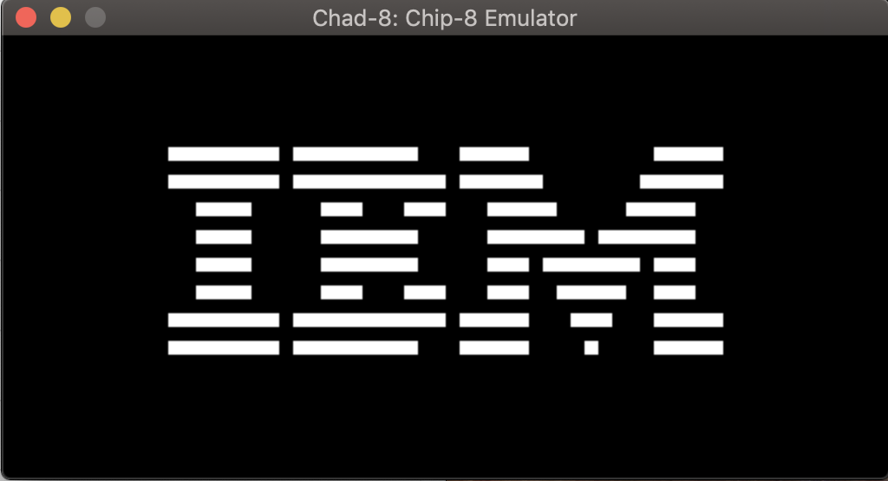
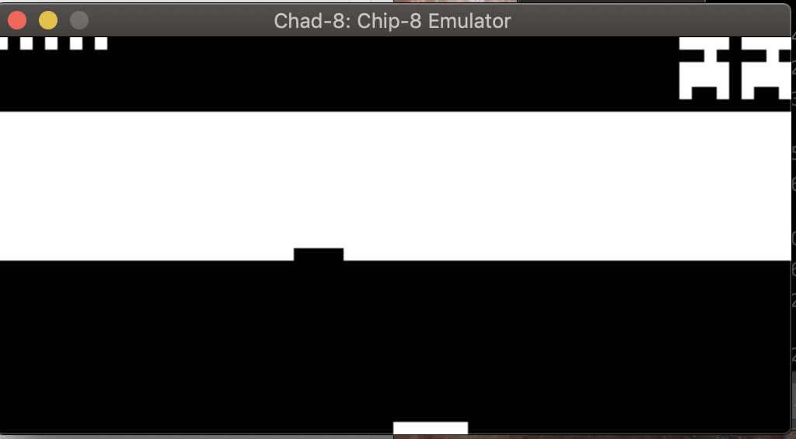

# Chad 8 Emu

Small toy emulator for chip-8, trying to learn a little bit more about processors.

Cowgod's Chip-8 Technical Reference: http://devernay.free.fr/hacks/chip8/C8TECH10.HTM

## Status

Works for the most part. I think i borked fonts though.

I think one (or more) of my instruction handlers have a small bug in them propogating out beecause of that.

